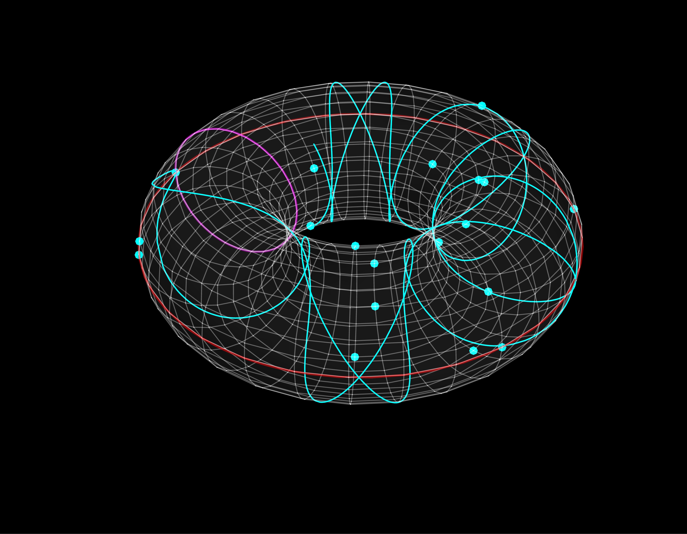

# Elliptic Curve Visualization

This repository contains a collection of scripts and tools for visualizing elliptic curves mapped onto a torus, particularly over finite fields. The scripts are written in Wolfram Language (Mathematica) and are intended for generating 3D visualizations of elliptic curve points in modular arithmetic.

## Table of Contents

- [Introduction](#introduction)
- [Features](#features)
- [Installation](#installation)
- [Usage](#usage)
- [Example](#example)
- [Contributing](#contributing)
- [License](#license)

## Introduction

Elliptic curves are fundamental objects in number theory and cryptography. This project focuses on visualizing these curves over finite fields and mapping them onto the surface of a torus. The visualizations provide insights into the structure of elliptic curves and their properties when working in modular arithmetic.

## Features

- Visualization of elliptic curves over finite fields.
- 3D mapping of elliptic curve points onto a torus.
- Support for various parameters including curve coefficients, field size, and iterations.
- Customizable rendering options such as mesh generation and curve thickness.

## Installation

To use these scripts, you need Wolfram Mathematica installed on your system.

1. Clone the repository:
   ```bash
   git clone https://github.com/slonweiss/elliptic-curve-visualization.git
   ```
2. Open the `.wl` scripts in Mathematica.

## Usage

The main script files are structured as follows:

- `Elliptic-Curve-Loopv2.wl`: Handles the core loop for iterating through elliptic curve points and exporting visualizations.
- `Elliptic-Curve-Visualization_Export-*.wl`: Multiple versions for experimenting with curve mapping and visual styles.
- `WeierstrassCurvePlot`: The primary function used to plot the elliptic curves on a torus.

To generate a visualization, you can execute the provided scripts in Mathematica. For example:

```mathematica
Get["path/to/Elliptic-Curve-Loopv2.wl"]
WeierstrassCurvePlot[iterations, primeModulus]
```

## Example

Below is an example of the visualizations produced:

- 

## Contributing

Contributions are welcome! Feel free to submit a pull request or open an issue to discuss improvements.

## License

This project is licensed under the MIT License. See the [LICENSE](LICENSE) file for details.
